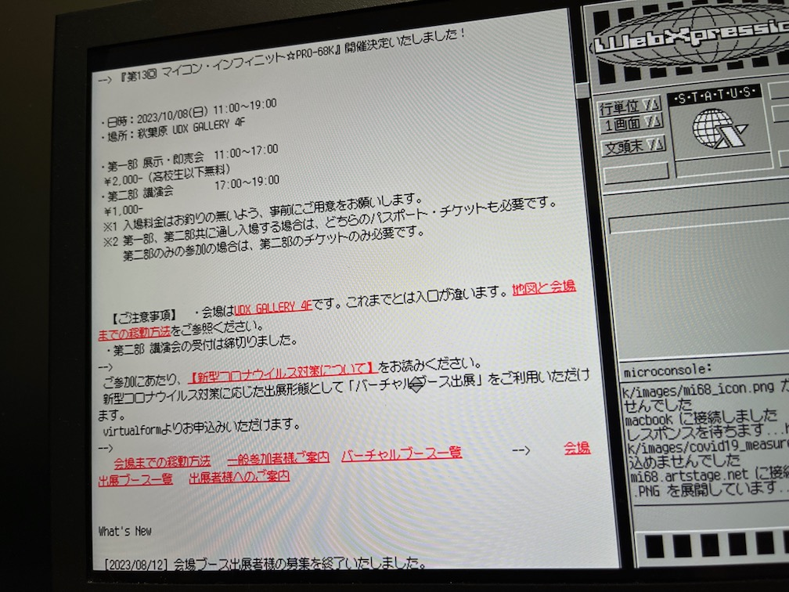
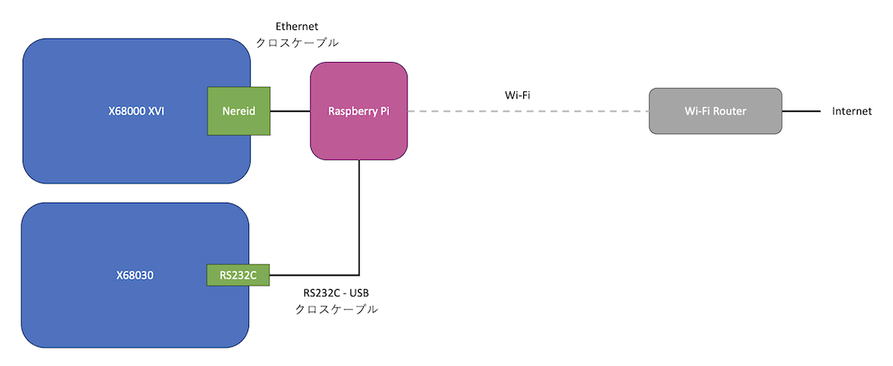

# nereid-wifi-connection

X680x0 + Nereid + Wi-Fi LAN + Internet connection setup guide

---

## はじめに

X680x0 実機 + Nereid (USB/LAN/MEM拡張ボード) をインターネットに接続可能な家庭内 Wi-Fi LANに参加させる際の構成例の覚書です。

以下の3つの構成について記述しています。

1. Wi-Fiルータに物理的にケーブル接続

2. Wi-Fiコンバータの利用

3. Raspberry Piの利用

また、3.の応用として、Nereid を持っていない X680x0 を RS232C - USBクロスケーブルを使ったPPP接続することで同じネットワークに参加させる構成も紹介します。

---

## X680x0側設定 (共通)

### CONFIG.SYS

Nereidの推奨設定に従うが、ether_ne.sys の代わりに etherL12.sys を使う。

        FILES     = 50
        BUFFERS   = 99 4096
        LASTDRIVE = Z:
        PROCESS   = 32 10 50
        DEVICE    = \USR\SYS\etherL12.sys

### \etc\protocols
        ip    0     IP
        icmp  1     ICMP
        tcp   6     TCP
        udp   17    UDP

### \etc\services
        ftp-data  20/tcp
        ftp       21/tcp
        telnet    23/tcp
        domain    53/tcp    nameserver
        domain    53/udp    nameserver
        finger    79/tcp    finger

---

## 設定パターン1. Wi-Fiルータに物理的にケーブル接続

物理的にケーブルが届き、かつケーブルが気にならないのであれば最も確実な接続方法と言えます。

* メリット ... 設定が簡単
* デメリット ... 距離によっては物理的に長いケーブルを這わせる必要がある

### 接続上の注意

* ストレートケーブルを使用すること。
* X680x0側は固定IPアドレスを使用する必要があるので、Wi-Fiルータの設定でDHCP払い出し範囲外のアドレスを使うか、MacアドレスによるIP割り当て固定などを行うこと。

### ネットワーク構成

* DNS(Wi-FiルータLAN側アドレス) ... 192.168.11.1
* デフォルトゲートウェイ(Wi-FiルータLAN側アドレス) ... 192.168.11.1
* サブネット ... 192.168.11.0/255.255.255.0
* X680x0 Nereid IPアドレス ... 192.168.11.68

### X680x0側設定 (AUTOEXEC.BAT)
        SET SYSROOT=C:\
        xip -n2
        ifconfig lp0 up
        ifconfig en0 192.168.11.68 netmask 255.255.255.0 up
        inetdconf +dns 192.168.11.1 +router 192.168.11.1
        
### X680x0側設定 (\etc\hosts)
        127.0.0.1       localhost   localhost.local
        192.168.11.68   x68000xvi   x68000xvi.local

### X680x0側設定 (\etc\network)
        127   loopback
        192.168.11  private-net

---

### 設定パターン2. Wi-Fiコンバータの利用

* メリット ... 設定が比較的簡単(特にWi-Fiルータと同じメーカーのコンバータであれば)
* デメリット ... Wi-Fiに繋がる以外のことができない

使っているWi-Fiコンバータはこれ。2012年製ですが、2023年現在普通に新品で買えます。

[Buffalo WLI-UTX-AG300/C](https://www.buffalo.jp/product/detail/wli-utx-ag300_c.html)

### 接続上の注意

* コンバータのUSB電源はX68の外から供給する。
* 絶対にコンバータの電源をNereidのUSB端子から取らないこと。
* サービスコンセントも68本体・電源に負担がかかるのでお勧めしません。

### WLI-UTX-AG300/C の設定

デフォルトで 1.1.1.1 固定IPとなっているので、有線Ethernetを備えたWindows PCなどでストレートケーブルで直結して設定を変更する。
その際にWindows側は固定IP 1.1.1.2 などにしておく。

管理画面でコンバータのIPは DHCPで自動取得 に変更しておく。

### ネットワーク構成

* DNS(Wi-FiルータLAN側アドレス) ... 192.168.11.1
* デフォルトゲートウェイ(Wi-FiルータLAN側アドレス) ... 192.168.11.1
* サブネット ... 192.168.11.0/255.255.255.0
* WLI-UTX-AG300 IPアドレス ... 192.168.11.x (DHCP自動取得)
* X680x0 Nereid IPアドレス ... 192.168.11.68

### X680x0側設定 (AUTOEXEC.BAT)
        SET SYSROOT=C:\
        xip -n2
        ifconfig lp0 up
        ifconfig en0 192.168.11.68 netmask 255.255.255.0 up
        inetdconf +dns 192.168.11.1 +router 192.168.11.1
        
### X680x0側設定 (\etc\hosts)
        127.0.0.1       localhost   localhost.local
        192.168.11.68   x68000xvi   x68000xvi.local

### X680x0側設定 (\etc\network)
        127   loopback
        192.168.11  private-net

---

## 設定パターン3. Raspberry Piの利用

* メリット ... 余ってるラズパイを活用できる。ラズパイにftpサーバを入れてファイルのやりとりができる。ラズパイに自前proxyサーバを入れて今時のWebサイトの閲覧ができる。ラズパイにpppサーバを入れてNereidの無い68からでもRS232Cでネット接続できる。
* デメリット ... 設定が若干複雑

### 接続上の注意

* 必ずクロスケーブルを使うこと
* 有線Ethernet端子のある3B+/4Bを使うこと

### ネットワーク構成

* DNS(Wi-FiルータLAN側アドレス) ... 192.168.11.1
* デフォルトゲートウェイ(Wi-FiルータLAN側アドレス) ... 192.168.11.1
* サブネット(WLAN) ... 192.168.11.0/255.255.255.0
* サブネット(有線Ethernet) ... 192.168.21.0/255.255.255.0
* Raspberry Pi IPアドレス(WLAN) ... 192.168.11.x (DHCP自動取得)
* Raspberry Pi IPアドレス(有線Ethernet) ... 192.168.21.101
* X680x0 Nereid IPアドレス ... 192.168.21.68

### X680x0側設定 (AUTOEXEC.BAT)

設定1,2とは異なるので注意

        SET SYSROOT=C:\
        xip -n2
        ifconfig lp0 up
        ifconfig en0 192.168.21.68 netmask 255.255.255.0 up
        inetdconf +dns 192.168.11.1 +router 192.168.21.1
        
### X680x0側設定 (\etc\hosts)

設定1,2とは異なるので注意

        127.0.0.1       localhost   localhost.local
        192.168.21.68   x68000xvi   x68000xvi.local
        192.168.21.101  raspi       raspi.local

### X680x0側設定 (\etc\network)

設定1,2とは異なるので注意

        127   loopback
        192.168.21  private-net

### Raspberry Pi設定 (/etc/dhcpcd.conf)

        # Example static IP configuration:
        interface eth0
        static ip_address=192.168.21.101/24

### Raspberry Pi設定 (IPルーティングの有効化 と IPv6の無効化)

これ以降の設定を行わない場合は X680x0 - Raspberry Pi 間の peer-to-peer 通信のみとなります。

        sudo vi /etc/sysctl.conf

コメントアウトされている行を有効化

        net.ipv4.ip_forward=1 

以下の行を追加

        net.ipv6.conf.all.disable_ipv6=1 

再起動

        sudo reboot

ipv6の行が出力されないことを確認

        ifconfig

### Raspberry Pi設定 (iptables)

        $ sudo apt install iptables-persistent
        $ sudo iptables –-table nat –-append POSTROUTING --out-interface wlan0 -j MASQUERADE
        $ sudo iptables -t nat -L -v -n
        $ sudo netfilter-persistent save

もし上記設定だけだとルーティングされない場合は以下追加

        $ sudo iptables –-append FORWARD –-in-interface eth0 -j ACCEPT

---

---

## 設定パターン3a. Raspberry PiをPPPサーバとしても利用

* メリット ... Nereidを持っていないX680x0でもネットワークに参加できる。
* デメリット ... Nereidほどのスピードはでない。

### 接続上の注意

* RS232C 25pin - 9pin クロスケーブル + RS232C 9pin - USB 変換ケーブルを組み合わせて使うこと
* RS232C - USB 変換ケーブルは FTDIチップセットを使ったものを推奨

### PPPソフトウェアダウンロード

Human68k版移植開発者の白方さんのサイトからダウンロードできます。

* [X680x0のインターネット関係ツールのページ](https://argrath.ub32.org/x680x0/internet.html)

### 参考情報

パピコニアンさんのサイトが大変参考になります。(この覚書とは細部は少し異なりますがおおよそやることは同じです)

* [X68000とRaspberry Piをシリアル接続してX68000にネット環境を構築する](http://retropc.net/mm/x68k/rasp-x/)

### ネットワーク構成

* DNS(Wi-FiルータLAN側アドレス) ... 192.168.11.1
* デフォルトゲートウェイ(Wi-FiルータLAN側アドレス) ... 192.168.11.1
* サブネット(WLAN) ... 192.168.11.0/255.255.255.0
* サブネット(PPP) ... 192.168.31.0/255.255.255.0
* Raspberry Pi IPアドレス(WLAN) ... 192.168.11.x (DHCP自動取得)
* Raspberry Pi IPアドレス(PPP) ... 192.168.31.101
* X680x0 PPP IPアドレス ... 192.168.31.68

### Raspberry Pi設定 (IPルーティングの有効化 と IPv6の無効化)

設定3で既に実施している場合は不要

        sudo vi /etc/sysctl.conf

コメントアウトされている行を有効化

        net.ipv4.ip_forward=1 

以下の行を追加

        net.ipv6.conf.all.disable_ipv6=1 

再起動

        sudo reboot

ipv6の行が出力されないことを確認

        ifconfig

### Raspberry Pi設定 (iptables)

設定3で既に実施している場合は不要

        sudo apt install iptables-persistent
        sudo iptables –-table nat –-append POSTROUTING --out-interface wlan0 -j MASQUERADE
        sudo iptables -t nat -L -v -n
        sudo netfilter-persistent save

もし上記設定だけだとルーティングされない場合は以下追加

        sudo iptables –-append FORWARD –-in-interface ppp0 -j ACCEPT

### Raspberry Pi PPPサーバの起動

既にインストールされているはずだけど念の為

        sudo apt install ppp

pppd.sh を以下の内容で作成する

        /usr/sbin/pppd /dev/ttyUSB0 38400 local 192.168.31.101:192.168.31.68 noipv6 proxyarp local noauth debug nodetach dump nocrtscts passive persist maxfail 0 holdoff 1 noauth

pppd.sh 起動

        nohup sudo ./pppd.sh > log-pppd &

68を再起動して接続できることを確認する。

### X680x0側設定 (CONFIG.SYS)

etherL12.sys の代わりに ppp.sys を組み込む。

        FILES     = 50
        BUFFERS   = 99 4096
        LASTDRIVE = Z:
        PROCESS   = 32 10 50
        DEVICE    = \USR\SYS\ppp.sys

### X680x0側設定 (\etc\hosts)

設定3とは異なるので注意

        127.0.0.1       localhost   localhost.local
        192.168.31.68   x68030      x68030.local
        192.168.31.101  raspi2       raspi2.local

### X680x0側設定 (\etc\network)

設定3とは異なるので注意

        127   loopback
        192.168.31  private-net

### X680x0側設定 (\etc\linkup.ppp)

デフォルトのまま

        MYADDR:
          keep

### X680x0側設定 (\etc\conf.ppp)

以下追記する

    raspi:
      set debug phase
      disable vjcomp
      deny vjcomp
      disable lqr
      deny lqr
      disable pred1
      deny pred1
      disable chap
      disable pap
      deny chap
      deny pap
      set openmode active
      set speed 9600
      set ifaddr 192.168.31.68 192.168.31.101
      dial

### X680x0側設定 (AUTOEXEC.BAT)

設定3とは異なるので注意

        SET SYSROOT=C:\
        SET PPP=C:\ETC
        SET PPPLOG=C:\TEMP\PPP.LOG
        SET HOST=x68030
        tmsio
        xip -n2
        ppp raspi
        inetdconf +dns 192.168.11.1 +router 192.168.31.1

### PPP経由のTELNETで電子公告を表示する例

