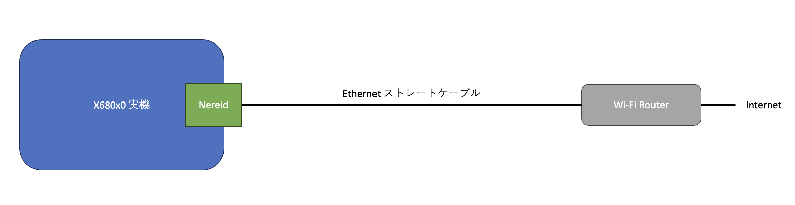
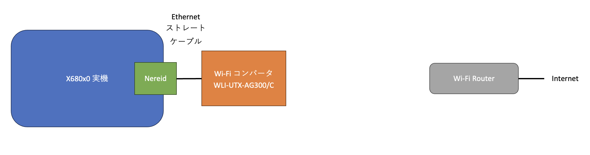
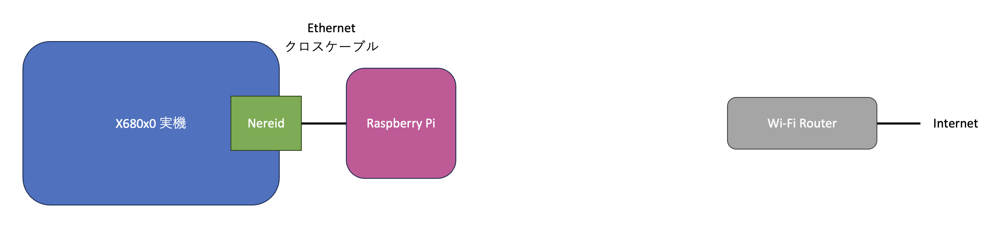

# nereid-internet-connection

X680x0 + Nereid - Internet connection setup guide

---

## はじめに

X680x0 実機 + Nereid (USB/LAN/MEM拡張ボード) を家庭内 Wi-Fi LANに参加させる際の構成例の覚書です。

以下の3つの構成について記述しています。

1. Wi-Fiルータに物理的にケーブル接続

2. Wi-Fiコンバータの利用

3. Raspberry Piの利用

---

## 設定パターン1. Wi-Fiルータに物理的にケーブル接続

物理的にケーブルが届き、かつケーブルが気にならないのであれば最も確実な接続方法と言えます。

* メリット ... 設定が簡単
* デメリット ... 距離によっては物理的に長いケーブルを這わせる必要がある

### 接続上の注意

* ストレートケーブルを使用すること。
* X680x0側は固定IPアドレスを使用する必要があるので、Wi-Fiルータの設定でDHCP払い出し範囲外のアドレスを使うか、MacアドレスによるIP割り当て固定などを行うこと。

### ネットワーク設定

* DNS(Wi-FiルータLAN側アドレス) ... 192.168.11.1
* デフォルトゲートウェイ(Wi-FiルータLAN側アドレス) ... 192.168.11.1
* サブネット ... 192.168.11.0/255.255.255.0
* X680x0 Nereid IPアドレス ... 192.168.11.68

### X680x0側設定

#### CONFIG.SYS

Nereidの推奨設定に従うが、ether_ne.sys の代わりに etherL12.sys を使う。

        FILES     = 50
        BUFFERS   = 99 4096
        LASTDRIVE = Z:
        PROCESS   = 32 10 50
        DEVICE    = \USR\SYS\etherL12.sys

#### AUTOEXEC.BAT
        xip -n2
        ifconfig lp0 up
        ifconfig en0 192.168.11.68 netmask 255.255.255.0 up
        inetdconf +dns 192.168.11.1 +router 192.168.11.1
        
### \etc\hosts
        127.0.0.1       localhost   localhost.local
        192.168.11.68   x68000xvi   x68000xvi.local

### \etc\network
        127   loopback
        192.168.11  private-net

### \etc\protocols
        ip    0     IP
        icmp  1     ICMP
        tcp   6     TCP
        udp   17    UDP

### \etc\services
        ftp-data  20/tcp
        ftp       21/tcp
        telnet    23/tcp
        domain    53/tcp    nameserver
        domain    53/udp    nameserver
        finger    79/tcp    finger

---

### 設定パターン2. Wi-Fiコンバータの利用

* メリット ... 設定が比較的簡単(特にWi-Fiルータと同じメーカーのコンバータであれば)
* デメリット ... Wi-Fiに繋がる以外のことができない

使っているWi-Fiコンバータはこれ。2012年製ですが、2023年現在普通に新品で買えます。

[Buffalo WLI-UTX-AG300/C](https://www.buffalo.jp/product/detail/wli-utx-ag300_c.html)

### 接続上の注意

* コンバータのUSB電源はX68の外から供給する。
* 絶対にコンバータの電源をNereidのUSB端子から取らないこと。
* サービスコンセントも68本体・電源に負担がかかるのでお勧めしません。

### WLI-UTX-AG300/C の設定

デフォルトで 1.1.1.1 固定IPとなっているので、有線Ethernetを備えたWindows PCなどでストレートケーブルで直結して設定を変更する。
その際にWindows側は固定IP 1.1.1.2 などにしておく。

管理画面でコンバータのIPは DHCPで自動取得 に変更しておく。

### ネットワーク設定

* DNS(Wi-FiルータLAN側アドレス) ... 192.168.11.1
* デフォルトゲートウェイ(Wi-FiルータLAN側アドレス) ... 192.168.11.1
* サブネット ... 192.168.11.0/255.255.255.0
* WLI-UTX-AG300 IPアドレス ... 192.168.11.x (DHCP自動取得)
* X680x0 Nereid IPアドレス ... 192.168.11.68

### X680x0側設定

#### CONFIG.SYS

Nereidの推奨設定に従うが、ether_ne.sys の代わりに etherL12.sys を使う。

        FILES     = 50
        BUFFERS   = 99 4096
        LASTDRIVE = Z:
        PROCESS   = 32 10 50
        DEVICE    = \USR\SYS\etherL12.sys

#### AUTOEXEC.BAT
        xip -n2
        ifconfig lp0 up
        ifconfig en0 192.168.11.68 netmask 255.255.255.0 up
        inetdconf +dns 192.168.11.1 +router 192.168.11.1
        
### \etc\hosts
        127.0.0.1       localhost   localhost.local
        192.168.11.68   x68000xvi   x68000xvi.local

### \etc\network
        127   loopback
        192.168.11  private-net

### \etc\protocols
        ip    0     IP
        icmp  1     ICMP
        tcp   6     TCP
        udp   17    UDP

### \etc\services
        ftp-data  20/tcp
        ftp       21/tcp
        telnet    23/tcp
        domain    53/tcp    nameserver
        domain    53/udp    nameserver
        finger    79/tcp    finger

---

## 設定パターン3. Raspberry Piの利用

* メリット ... 余ってるラズパイを活用できる。ラズパイにftpサーバを入れてファイルのやりとりができる。
* デメリット ... 設定が若干複雑

---

## 参考にさせて頂いたサイト

* [X680x0のインターネット関係ツールのページ](https://argrath.ub32.org/x680x0/internet.html)

X680x0にPPPその他を移植された白方さんのサイトです。

* [Raspberry PiでWiFiアクセスポイント構築](https://zenn.dev/yutafujii/books/fcb457e798a3d5)

iptablesの設定を使わせて頂きました。